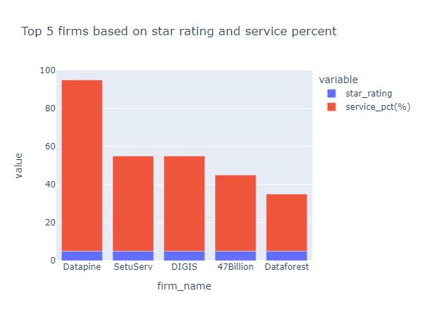

# Web Scraping Top Data Firms
## [View Full Project](https://nbviewer.org/github/TelRich/Data-Analytics-Company-Web-Scraping/blob/main/top_da_company.ipynb)

### Summary

* The webpage from Goodfirm was succesfully accessed and downloaded using Request library. 
* BeautifulSoup was used to locate and extract the details from the downloaded html file
* The extracted details was converted to data frame using Pandas.
* The file was cleaned and changed to its right datatype
* The cleaned file was explored for some insights.

#### Findings
* About 30 firms are rated 5 star while 12 are rated between 4.8 - 4.9
* Very few firms (3) has a review above 30
* Most of the firms are located in United States followed by India.